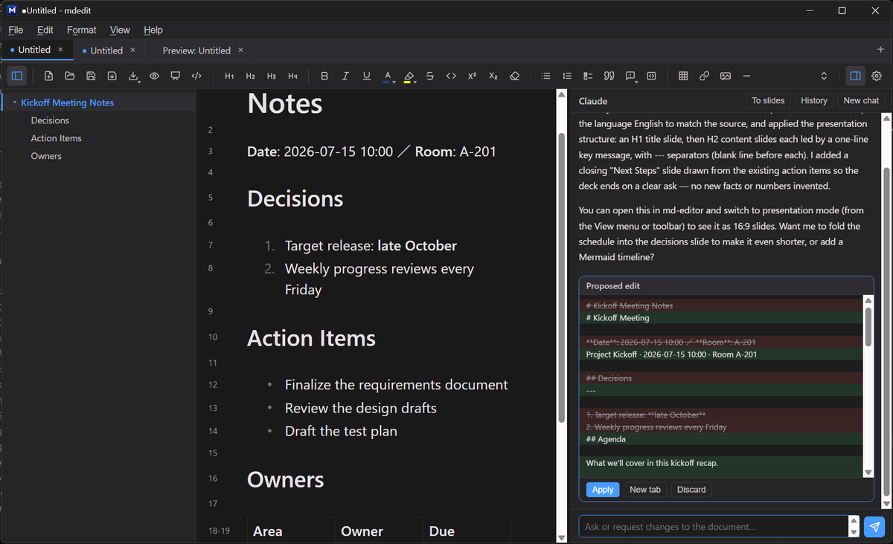
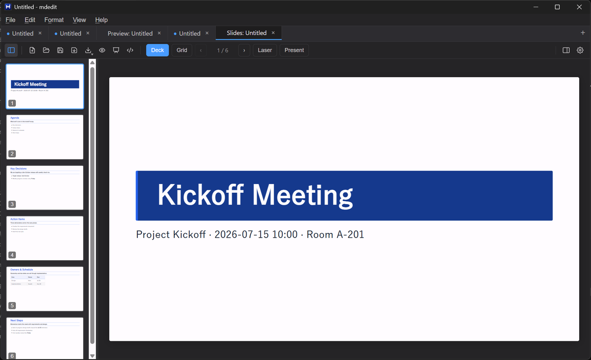

[English](./README.md) | **日本語**

# mdedit

**軽量・無料・オープンソースの WYSIWYG Markdown エディタ。**
書式が反映されたまま編集でき、Mermaid 図のインラインプレビューと「見たまま」の HTML 出力に対応します。有料化した Typora の代替を探している人にも向いています。


<!-- 最重要: 起動〜編集の様子が伝わる GIF を 1 枚（docs/assets/demo.gif） -->


## mdedit とは

Markdown を「記号を見ながら書く」のではなく、**仕上がりの見た目のまま編集できる**デスクトップアプリです。プレビュー用の別ペインを行き来する必要がなく、書いたものがそのまま文書になります。Mermaid による図、HTML やPDFへの書き出し、文書をそのままスライドとして発表する機能、複数ウィンドウ・タブでの作業にも対応しています。さらにオプションの **Claude チャットパネル**で、文書について質問したり、差分プレビュー付きの編集提案を受け取ったりできます（Claude のサブスクリプションで動作、API キー不要）。

## なぜ mdedit か

- **書いたまま見える** — 太字や見出し、リストが反映された状態で直接編集できます（WYSIWYG）。プレビューの往復が不要です。
- **生のソースも見られる** — `Ctrl+Shift+I` で、記号付きの生 Markdown 表示（行番号付き）と仕上がり表示をワンキーで切り替えられます。
- **図がそのまま描ける** — コードに書いた Mermaid がリアルタイムで図になり、クリックで拡大できます。図だけのファイル（`.mmd` / `.mermaid`）も開けます。
- **Claude に文書のことを聞ける** — オプションのチャットパネルが [Claude Code CLI](https://claude.com/claude-code) と連携し、いつものサブスクリプションで動きます（API キー不要）。質問への回答のほか、編集は差分プレビューで提案され、ワンクリックで適用。右クリックで選択範囲を引用でき、過去の会話も「履歴」から再開できます。
- **そのまま発表できる** — 同じ文書を 16:9 のスライドにして全画面で発表できます。サムネ一覧（デッキ）・一覧表示・レーザーポインタ付き（`Ctrl+Shift+P`）。スライドは `---` または見出しで区切られます。チャットの**「プレゼン変換」ボタン**（または付属の [Claude Code スキル](./skills/presentation-md)）で、メモをプレゼン用 Markdown に整形できます。
- **見たまま出力できる** — 編集画面とまったく同じ見た目で HTML に書き出し、PDF にも印刷できます。
- **軽くて速い** — Tauri 製のため、インストーラが小さく起動も軽快です。
- **日本語で使える** — 日本語・英語に対応し、ダーク／ライトのテーマを切り替えられます。

## スクリーンショット

| WYSIWYG 編集 | Claude チャット | プレゼン |
|---|---|---|
|  |  |  |

| Mermaid プレビュー | HTML 出力 |
|---|---|
|  |  |

## ダウンロード

最新版は [Releases](https://github.com/hiperjack/md-editor/releases) から入手できます。

| OS | 形式 |
|---|---|
| Windows | `.msi` または `.exe`（インストーラ） |
| macOS | `.dmg` |
| Linux | `.AppImage` または `.deb` |

> **Windows で警告が出る場合:** 現在のビルドはコード署名をしていないため、起動時に「Windows によって PC が保護されました」と表示されることがあります。［詳細情報］→［実行］で起動できます（署名証明書の導入は検討中です）。

> **macOS で「壊れているため開けません」と出る場合:** アドホック署名のため、初回は Finder でアプリを右クリック →［開く］で起動してください。

## 使い方の基本

- `.md` / `.markdown` ファイルをダブルクリックすると、エディタの新しいタブで開きます。
- `.mmd` / `.mermaid` ファイルは図として開き、保存時に元のソース形式へ戻します。
- `.html` ファイルは、読み取り専用のプレビュータブで表示します。
- タブはドラッグで並べ替えられ、ウィンドウの外へ出すと別ウィンドウになります。

## Claude チャット（オプション）

mdedit には Claude を編集アシスタントとして組み込めます。あなたのマシンの Claude Code CLI と連携するため、いつものサブスクリプションがそのまま使えます（API キーの管理は不要）。

1. [Claude Code CLI](https://claude.com/claude-code) をインストールし、ターミナルで一度 `claude` を実行してログインする
2. **設定 →「Claude チャットを使う」**をオンにすると、ツールバーにチャットボタンが現れる
3. パネルを開いて質問するだけ。開いている文書（未保存の編集込み）がコンテキストになります

できること:

- **文書についての質問** — 回答はパネルにストリーミング表示
- **編集の提案は差分プレビューで** — 「適用」を押すまで何も変わりません（「新規タブへ」で元の文書を残したまま開くことも可能）。ディスク上のファイルを直接書き換えることはなく、適用は Undo で戻せます
- **選択範囲と連携** — テキストを選択して右クリック→「選択をチャットで引用」。選択したまま「ここを書き直して」と頼むだけでも通じます
- **プレゼン変換** — ワンクリックで文書をプレゼン用 Markdown に変換
- **履歴** — 過去の会話はアーカイブされ、文脈ごと再開できます
- **Web 検索** — 既定でオン。機密文書を扱うときは設定でオフにできます

## よく使うショートカット

| ショートカット | 動作 |
|---|---|
| `Ctrl+N` / `Ctrl+O` / `Ctrl+S` | 新規タブ / 開く / 保存 |
| `Ctrl+Shift+E` | HTML として出力 |
| `Ctrl+Shift+V` | HTML プレビュータブを開く |
| `Ctrl+Shift+P` | プレゼン表示を開く（`F` で全画面発表） |
| `Ctrl+Shift+I` | ソース表示（生 Markdown 編集）の切替 |
| `Ctrl+P` | 印刷（PDF 保存も可能） |
| `Ctrl+F` / `Ctrl+H` | 検索 / 置換 |
| `Ctrl+Shift+O` | 見出しアウトラインの表示切替 |
| `Ctrl+B` / `Ctrl+I` / `Ctrl+K` | 太字 / 斜体 / リンク |
| `Ctrl+,` | 設定を開く |

全ショートカットの一覧は [docs/architecture.ja.md](./docs/architecture.ja.md) を参照してください。

## ソースからビルドする

**必要なもの:** Node.js 18 以上、Rust（[Tauri の前提条件](https://v2.tauri.app/start/prerequisites/)を参照）。

```bash
# 依存パッケージのインストール
npm install

# 開発モードで起動
npm run tauri:dev

# インストーラを生成
npm run tauri:build
```

## 技術スタック

| 層 | 採用技術 |
|---|---|
| デスクトップ基盤 | Tauri 2.x（Rust） |
| フロントエンド | Vite + TypeScript（UI フレームワーク不使用） |
| エディタ | Milkdown Crepe（ProseMirror 系 WYSIWYG） |
| 図 | Mermaid |
| AI アシスタント（オプション） | Claude Code CLI（サブスクリプション認証） |

設計の詳細・内部実装・ディレクトリ構成・全ショートカット一覧は [docs/architecture.ja.md](./docs/architecture.ja.md) にまとめています。

## ライセンス

[MIT License](./LICENSE)
